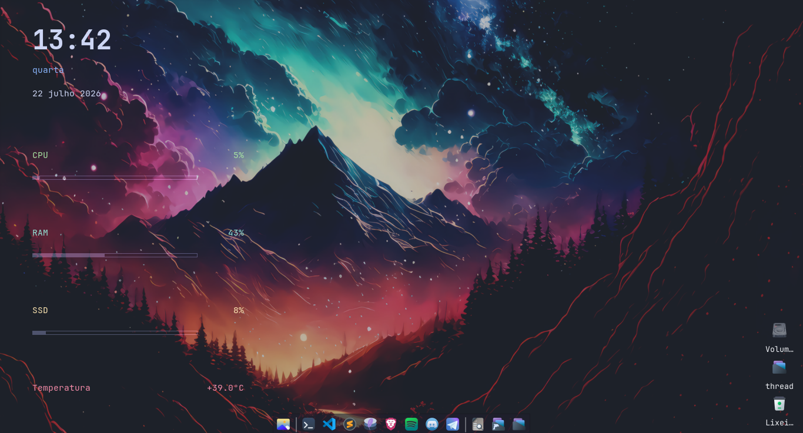

# Catppuccin Conky

Um dashboard minimalista para Debian 13 (Trixie) e XFCE.

## Preview

## Recursos

- Relógio
- CPU
- RAM
- Disco
- Temperatura
- Bateria
- Wi-Fi

## Roadmap

- [x] Sprint 1
- [ ] Sprint 2
- [ ] Sprint 3
- [ ] Sprint 4

## Requisitos

- Debian 13
- Conky 1.22+
- lm-sensors
- Nerd Fonts
